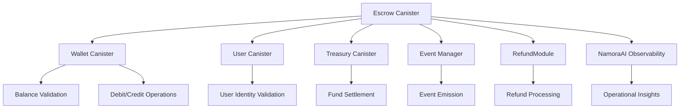

# Escrow Canister Comprehensive Overview

**Last Updated:** August 17, 2025  
**Canister ID:** `ufxgi-4p777-77774-qaadq-cai`  
**Status:** ✅ Production Ready - Advanced Triad Integration Target

## 🎯 Executive Summary

The Escrow canister is a **sophisticated financial services component** that provides secure, third-party mediated transactions within the AxiaSystem ecosystem. It serves as a critical infrastructure piece for trust-based transactions where funds need to be held securely until conditions are met.

**Triad Integration Potential: EXCEPTIONAL** ⭐⭐⭐⭐⭐

The escrow canister represents an ideal candidate for deep triad integration due to its:
- ✅ **Advanced State Management** - Complex escrow lifecycle with multiple states
- ✅ **Financial Operations** - Direct wallet integration and fund management
- ✅ **Event-Driven Architecture** - Comprehensive event emission for auditability
- ✅ **Refund Management** - Built-in enhanced refund system integration
- ✅ **Timeout Processing** - Automated cleanup and timeout handling
- ✅ **Cross-Canister Integration** - Deep integration with wallet, user, and treasury

## 🏗️ Architectural Overview

### Core Components

```
📦 Escrow Canister Structure
├── 🎯 main.mo                    # Primary API interface
├── 📋 modules/
│   └── escrow_module.mo          # Core escrow logic and state management
├── 🔧 services/
│   └── escrow_service.mo         # Service layer abstraction
└── 🔗 utils/
    └── escrow_canister_proxy.mo  # Cross-canister proxy interface
```

### Integration Dependencies



## 🔧 Core Functionality Analysis

### 1. Escrow Lifecycle Management

#### **EscrowState Structure**
```motoko
public type EscrowState = {
    id: Nat;                    // Unique escrow identifier
    sender: Principal;          // Party depositing funds
    receiver: Principal;        // Party receiving funds
    tokenId: Nat;              // Token type identifier
    amount: Nat;               // Escrow amount
    conditions: Text;          // Release conditions
    isReleased: Bool;          // Release status
    isCanceled: Bool;          // Cancellation status
    createdAt: Nat;            // Creation timestamp
};
```

#### **State Transitions**
```
CREATED → [RELEASED | CANCELED | TIMEOUT]

States:
- 🟡 CREATED: Funds held, conditions pending
- 🟢 RELEASED: Funds transferred to receiver
- 🔴 CANCELED: Funds returned to sender
- ⏰ TIMEOUT: Auto-canceled after threshold
```

### 2. Financial Operations

#### **Fund Management Flow**
1. **Creation**: Validate sender balance → Debit sender wallet → Create escrow record
2. **Release**: Validate escrow state → Credit receiver wallet → Mark released
3. **Cancel**: Validate escrow state → Credit sender wallet → Mark canceled
4. **Timeout**: Check timeout threshold → Auto-cancel → Process refunds

#### **Wallet Integration**
```motoko
// Balance validation before escrow creation
let senderBalance = await walletProxy.getWalletBalance(sender);
if (balance < amount) return #err("Insufficient balance");

// Fund operations
await walletProxy.debitWallet(sender, amount, tokenId);  // Lock funds
await walletProxy.creditWallet(receiver, amount, tokenId); // Release funds
```

### 3. Event-Driven Architecture

#### **Event Types Emitted**
```motoko
#EscrowCreated {
    escrowId: Nat;
    sender: Principal;
    receiver: Principal;
    tokenId: Nat;
    amount: Nat;
}

#EscrowReleased {
    escrowId: Text;
    sender: Text;
    receiver: Text;
    amount: Nat;
    tokenId: Text;
}

#EscrowCanceled {
    escrowId: Text;
    sender: Text;
    amount: Nat;
    tokenId: Text;
}

#EscrowTimeoutProcessed {
    timeoutCount: Nat;
    timestamp: Nat64;
}
```

### 4. Enhanced Refund System Integration

#### **Refund Request Management**
The escrow canister includes comprehensive refund management capabilities:

```motoko
// Create escrow-specific refund request
public shared func createEscrowRefundRequest(
    escrowId: Nat,
    requestedBy: Principal,
    amount: Nat,
    reason: ?Text
): async Result.Result<Nat, Text>

// Admin approval workflow
public shared func approveEscrowRefundRequest(
    refundId: Nat,
    adminPrincipal: Principal,
    adminNote: ?Text
): async Result.Result<(), Text>
```

#### **Refund Lifecycle**
```
REQUEST → PENDING_REVIEW → [APPROVED → PROCESSING → COMPLETED]
                        → [DENIED]
```

## 🎯 API Reference

### Core Escrow Operations

| Method | Purpose | Parameters | Returns |
|--------|---------|------------|---------|
| `createEscrow` | Create new escrow | sender, receiver, tokenId, amount, conditions | `Result<Nat, Text>` |
| `releaseEscrow` | Release funds to receiver | escrowId | `Result<(), Text>` |
| `cancelEscrow` | Cancel and refund | escrowId | `Result<(), Text>` |
| `getEscrow` | Get escrow details | escrowId | `Result<EscrowState, Text>` |
| `listEscrows` | List all escrows | - | `[EscrowState]` |

### Advanced Operations

| Method | Purpose | Parameters | Returns |
|--------|---------|------------|---------|
| `processEscrowTimeouts` | Process expired escrows | timeoutThreshold | `Result<Nat, Text>` |
| `healthCheck` | System health status | - | `Text` |
| `runHeartbeat` | Maintenance operations | - | `()` |

### Refund Management API

| Method | Purpose | Parameters | Returns |
|--------|---------|------------|---------|
| `createEscrowRefundRequest` | Create refund request | escrowId, requestedBy, amount, reason | `Result<Nat, Text>` |
| `listEscrowRefundRequests` | List refund requests | status, requestedBy, timeframe, pagination | `Result<[RefundRequest], Text>` |
| `approveEscrowRefundRequest` | Admin approval | refundId, adminPrincipal, adminNote | `Result<(), Text>` |
| `denyEscrowRefundRequest` | Admin denial | refundId, adminPrincipal, adminNote | `Result<(), Text>` |
| `getEscrowRefundStats` | Refund statistics | - | `RefundStats` |

## 🧠 NamoraAI Observability Integration

### Insight Emission
The escrow canister provides comprehensive observability through NamoraAI insights:

```motoko
// Example insights emitted
"Escrow creation initiated from [sender] to [receiver] for amount: [amount]"
"Escrow #[id] successfully created - amount: [amount]"
"Escrow release requested for escrow #[id]"
"Escrow #[id] successfully released to receiver"
"Escrow refund request initiated for escrow #[id] by [user]"
```

### Monitoring Capabilities
- ✅ **Transaction Flow Tracking** - Complete lifecycle monitoring
- ✅ **Error Detection** - Automatic error insight emission
- ✅ **Performance Metrics** - Operation timing and success rates
- ✅ **Security Monitoring** - Unusual activity detection
- ✅ **Financial Auditing** - Complete transaction audit trail

## 🔄 Triad Integration Opportunities

### 1. Asset-Asset Registry-Escrow Triad

**Integration Concept**: Secure asset transactions with escrow protection
```
Asset Creation → Escrow Hold → Ownership Transfer → Asset Registry Update
```

**Benefits**:
- ✅ **Secure Asset Sales** - Buyer funds held until asset transfer confirmed
- ✅ **Dispute Resolution** - Built-in refund mechanisms for failed transfers
- ✅ **Regulatory Compliance** - Complete audit trail for asset transactions
- ✅ **Multi-Token Support** - Support for various asset types and currencies

### 2. User-Wallet-Escrow Triad

**Integration Concept**: User-mediated escrow transactions with wallet integration
```
User Authentication → Wallet Validation → Escrow Creation → Transaction Settlement
```

**Benefits**:
- ✅ **Identity Verification** - Ensure only authorized users create escrows
- ✅ **Balance Validation** - Real-time wallet balance checking
- ✅ **Transaction History** - Complete user transaction tracking
- ✅ **Automated Settlement** - Seamless fund transfers

### 3. Payment-Escrow-Treasury Triad

**Integration Concept**: Advanced payment processing with escrow and treasury integration
```
Payment Request → Escrow Hold → Condition Verification → Treasury Settlement
```

**Benefits**:
- ✅ **Conditional Payments** - Payments released only when conditions met
- ✅ **Risk Management** - Treasury oversight for large transactions
- ✅ **Liquidity Management** - Centralized fund management
- ✅ **Compliance Reporting** - Regulatory reporting capabilities

## 📊 Current Integration Status

### ✅ Existing Integrations
- **Wallet Canister**: Direct integration for fund management
- **Event Manager**: Complete event emission for auditability
- **RefundModule**: Enhanced refund system integration
- **NamoraAI**: Operational insights and monitoring
- **Main Backend**: Proxy integration for cross-canister calls

### 🔨 Enhancement Opportunities
- **Asset Registry Integration**: Link escrows to specific assets
- **NFT Marketplace Integration**: Support for NFT sales with escrow protection
- **Subscription Management**: Recurring payment escrow support
- **Multi-signature Support**: Enhanced security for high-value escrows
- **Automated Condition Verification**: Smart contract-like condition checking

## 🎯 Triad Integration Recommendations

### Phase 1: Asset-Escrow Integration
**Timeline**: 2-3 weeks
**Focus**: Link escrow creation to asset transactions
**Deliverables**:
- Asset-linked escrow creation
- Automatic asset transfer on escrow release
- Asset registry updates on transaction completion

### Phase 2: Advanced Payment Integration
**Timeline**: 3-4 weeks  
**Focus**: Deep payment system integration
**Deliverables**:
- Conditional payment processing
- Multi-step escrow workflows
- Treasury integration for large transactions

### Phase 3: Marketplace Ecosystem
**Timeline**: 4-5 weeks
**Focus**: Complete marketplace functionality
**Deliverables**:
- NFT marketplace escrow support
- Auction system integration
- Dispute resolution mechanisms

## 🔐 Security & Compliance Features

### Financial Security
- ✅ **Balance Validation** - Pre-transaction balance verification
- ✅ **Atomic Operations** - All-or-nothing transaction processing
- ✅ **State Consistency** - Robust state management and validation
- ✅ **Error Recovery** - Comprehensive error handling and rollback

### Audit & Compliance
- ✅ **Complete Event Trail** - Every operation logged and emitted
- ✅ **Timestamp Tracking** - Precise timing for all operations
- ✅ **Principal Tracking** - Complete user activity logging
- ✅ **Refund Audit Trail** - Detailed refund request and approval tracking

### Operational Security
- ✅ **Timeout Protection** - Automatic cleanup of stale escrows
- ✅ **Principal Validation** - Robust user identity verification
- ✅ **Amount Validation** - Overflow and underflow protection
- ✅ **State Validation** - Prevent invalid state transitions

## 🚀 Implementation Strategy

### Immediate Actions (Week 1)
1. **Triad Design Workshop** - Define specific integration patterns
2. **API Extension Planning** - Design new APIs for triad operations
3. **Event Schema Updates** - Enhance events for triad coordination
4. **Testing Strategy** - Comprehensive triad testing approach

### Development Phase (Weeks 2-4)
1. **Core Integration Development** - Implement basic triad functionality
2. **API Enhancements** - Add triad-specific endpoints
3. **Event System Updates** - Enhanced event coordination
4. **Frontend Integration** - UI updates for new functionality

### Testing & Deployment (Weeks 5-6)
1. **Integration Testing** - Comprehensive triad workflow testing
2. **Performance Testing** - Load testing with complex workflows
3. **Security Auditing** - Complete security review
4. **Production Deployment** - Staged rollout with monitoring

## 📈 Expected Benefits

### For Users
- 🎯 **Enhanced Security** - Protected transactions with built-in dispute resolution
- 🎯 **Simplified Workflows** - One-stop solution for complex transactions
- 🎯 **Transparency** - Complete visibility into transaction status
- 🎯 **Automated Processing** - Reduced manual intervention requirements

### For AxiaSystem
- 🎯 **Revenue Growth** - New escrow-based transaction models
- 🎯 **Risk Reduction** - Reduced transaction disputes and chargebacks
- 🎯 **Competitive Advantage** - Advanced escrow capabilities
- 🎯 **Regulatory Compliance** - Enhanced audit and reporting capabilities

### Technical Excellence
- 🎯 **Scalable Architecture** - Robust foundation for future growth
- 🎯 **Event-Driven Coordination** - Loose coupling with high cohesion
- 🎯 **Comprehensive Monitoring** - Complete operational visibility
- 🎯 **Automated Operations** - Reduced operational overhead

## 🎯 Conclusion

The Escrow canister represents a **premium integration target** for triad development due to its sophisticated architecture, comprehensive feature set, and critical role in financial transactions. Its advanced state management, event-driven design, and existing cross-canister integrations make it an ideal foundation for building complex, multi-canister workflows.

**Recommended Next Steps**:
1. **Prioritize Asset-Escrow integration** for immediate value
2. **Design comprehensive triad APIs** for seamless coordination
3. **Implement enhanced event coordination** for workflow management
4. **Develop comprehensive testing suite** for complex scenarios

The escrow canister's maturity and feature richness position it as a cornerstone component for AxiaSystem's advanced transaction processing capabilities.
